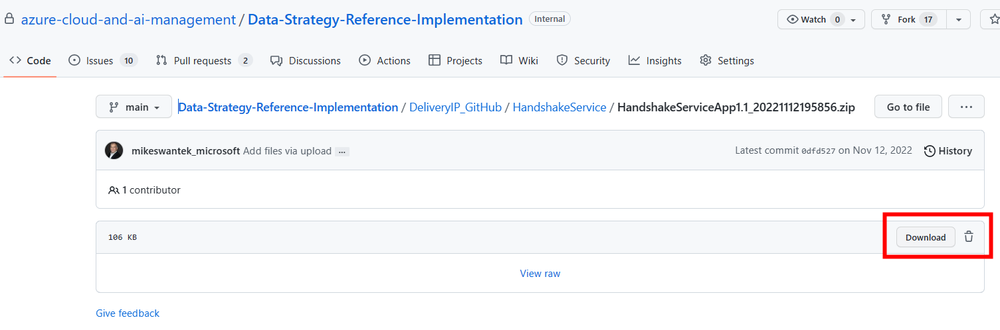
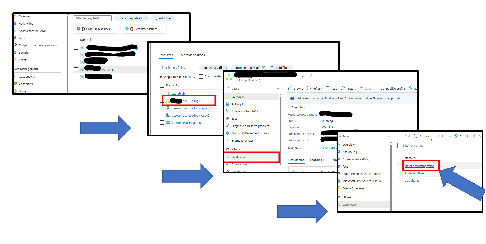
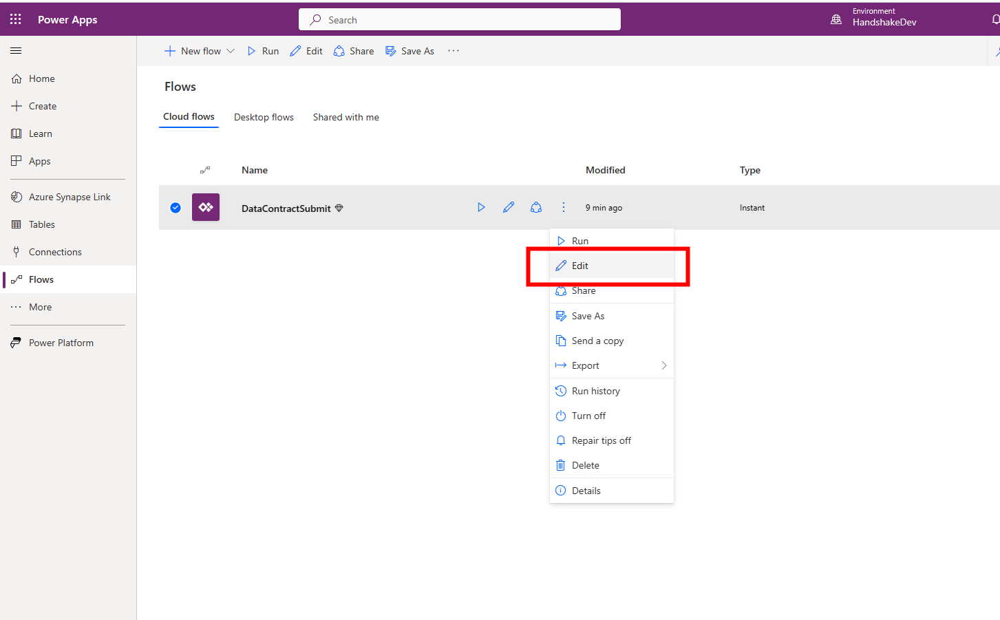
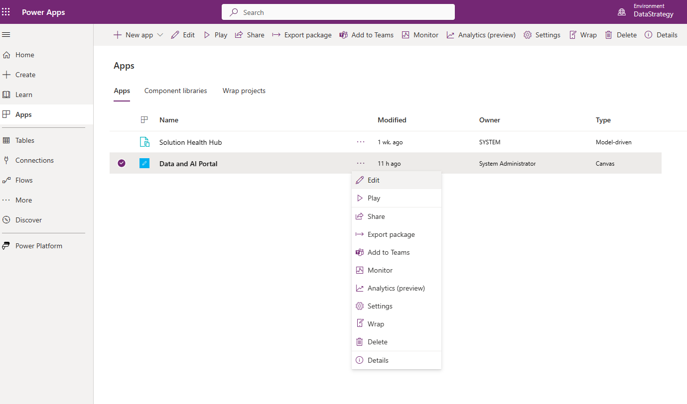

# Data and AI Portal Deployment
At this time, we do not have the deployment of the Power App and Power Automate flow automated. We are working on this. 
For now, please follow these steps to deploy and configure the Handshake App for use.

1. Download the zip file from the repo 

2. Open the Power App environment. This would be set up and supplied by the customer. We do not deploy the Power Platform via code at this time. 
3. Add the following connections to the environment:
- Microsoft 365 users connection - authenticate as admin of power platform (service account)

- Azure Blob Storage - this should connect to the landing ADLS2 account deployed,and needs to use access key for auth

- Azure SQL Server - Connect to this with the SPN used for deployment

4. Select the Apps tab in the left navigation and then Import Canvas App that you downloaded locally,using the button in the header.

5. Select the upload button and navigate to the location of the package file from the GitHub repo.

6.On this screen, you can rename the app before it is added to the environment. Select the ‘wrench’ icon to change settings. 
**Note that the flows needed to communicate with the Logic Apps are deployed with the app.**

7. The next step it so enable the flows. Navigate to the Flows section and notice that the flow is greyed out. This is because it is deployed in a disabled state. We must enable it for the solution to work. 
Click the triple dots and select ‘Turn on’

8. Now we will get the uri address that from the Logic App. We must get the endpoint address of the Logic App and copy it first.
 -  Navigate to the Logic App resource group in the subscription.
 -  Open the DataContractIngestion Logic app.

9. Edit the Logic App in Designer mode

10. Select the ‘When a HTTP request is received’ connector and copy the path.

111. Now we will edit the uri address that points to the Logic App. Start by editing the flow. You will need to navigate back to the Power Apps environment.

12. Select the HTTP connector and paste on the value copied from the Logic App in step 11

13. Save the Power Automate Flow

14. Repeat this process for each of the logic apps/flows

| Flowname | LogicApp called | SP it calls |
| --- | --- | --- |
| schema | getSchema | dbo.schemaDynamic (serverless) |
| GetSchemaSynapsedb | getSynapseTable | queries the information_schema.columns query  |
| DataContractSubmit | DatacontractSubmit | usp_InsertDataContract |
| getNewDataContract | getNewDataContract | queries the DataContract table |
| getMappingRecords | getMappingRecords | queries the mapping table |
| DataContractEdit | DataContractEdit | usp_EditDataContract |
| HandshakeSubmit | handshakeSubmit | usp_InsertHandshake |
|  | la_PackagePayloadConfigurator |  |
| DataContractMappingSubmit | MappingServiceIngestion | InsertDataMapping |
| getDatabases | getDatabases | Query: SELECT * FROM sys.databases  |
| getFromControl | getlistFromControlTable | Queries the IngestedLandingDataAudit |

15. One other Logic App needs to be configured prior to using the app. 
-select the la_PackagePayloadConfigurator Logic App and go into Designer

The last connector needs to be edited and must point towards the "DataContractIngestion" workflow that is part of the deployment. The purpose of this connector is to pass the new configuration parameters into the old process. As this process gets refined, the connections and processes will change. 

Now the required connections have been configured for the app and flows.

16. Navigate to the Power App and Edit the app

17. The first time this is edited, you will be prompted to connect to the needed connections. The system will install this as the user that is currently logged in, so be sure it is with the service account or admin account so that the connector will work for all users.
Click allow

18. Once the app is open, you will need to add several tables from SQL. (This step will be automated in the future).

19. Select the data icon in the left hand navigation.
You will see connections to the SQL control tables. These need to be removed and replaced with the links to the deployed tables by clicking the dots and saying remove.

20. Click the "Add Data" at the top of the list, select "Connectors" and then the SQL server. You will then be promted for the name of the server and the tables. 

Lastly, select these four tables.

21. Save and Publish the App!

At this point the Handshake Shared Service is configured and will now allow data registration into the control table.

